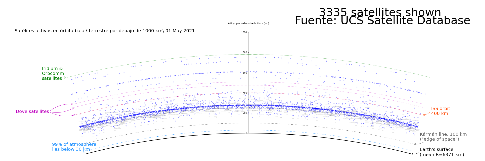

# Clunes de Ciencia 2021 

### Nombre del proyecto    
***Explorando el espacio a través de la pantalla: Ciencia de datos como apoyo al diseño de misiones espaciales***

### Miembros del equipo
Luis Carlos

[Alejandro Ruiz Diego](https://github.com/AlejandroRD98)

### ¿Qué hace este proyecto?
Con este proyecto buscamos mostrar como las herramientas de la ciencia computacional pueden apoyar para el estudio del espacio y el diseño de viajes de viajes espaciales. Para lograr nuestro objetivo analizamos una base de datos de más de 4000 satélites, adicionalmente con la información del dataset desarrollamos un mapa que permita observar la cantidad de satélites que orbitan al redor de la Tierra. 

También desarrollamos una misión espacial con objetivo de llegar a Júpiter y colocar un repetidor de señal interestelar con el fin de aumentar la distancia que una sonda puede transmitir a la Tierra, una vez que ha salido del sistema solar, permitiendo con esto explorar el espacio y obtener más específica de lo que hay más allá.

[Pagina web ](https://cdecmx-org.github.io/proyectos-2021-club_18_2/)

